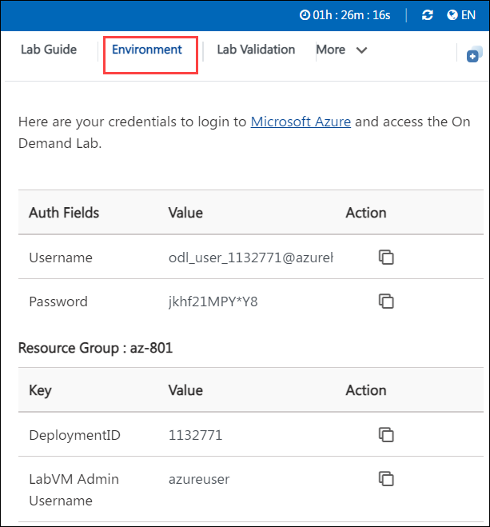
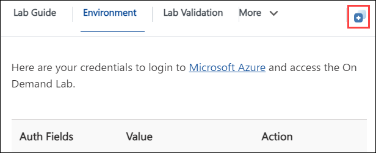
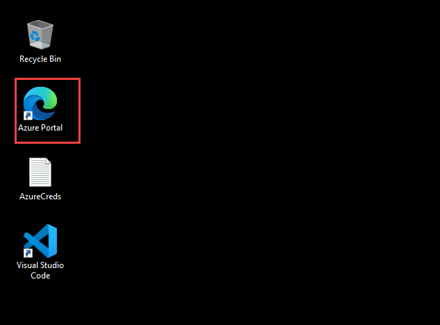

# Getting Started

1. Once the environment is provisioned, a virtual machine and lab guide will get loaded into your browser.

1. To get the lab environment details, you can select the **Environment Details** tab.

    

1. You can also open the Lab Guide on a separate full window by selecting the **Split Window** button from the bottom right corner.

    

1. To hide the lab guide, click on **>** symbol and to expose the lab guide, click on **<** symbol.   

1. Also, you can **start, stop and restart** the virtual machines from the **Resources** tab.

    

### Log in to Azure Portal and verify the pre-deployed resources.

1. In the virtual machine (VM) on the left, click on the Azure Portal as shown below.

    

1. On **Sign in to Microsoft Azure** blade, you will see a login screen, in that enter the following email/username and then click on **Next**. 
    * Email/Username: <inject key="AzureAdUserEmail"></inject>

     
     
1. Now enter the password and click on Sign in.
   * Password: <inject key="AzureAdUserPassword"></inject>
  
    
        
1. If you see the pop-up **Action Required**, click **Ask Later**.
   
    

1. First-time users are often prompted to Stay Signed In, if you see any such pop-up, click on No.

1. If a **Welcome to Microsoft Azure** popup window appears, click Maybe Later to skip the tour.
    
        
    

1. Click on **Next** from the bottom right and follow the instructions to perform the lab.

       