# Lab 09: Implementing operational monitoring in hybrid scenarios

>**Note:** An **[interactive lab simulation](https://mslabs.cloudguides.com/guides/AZ-801%20Lab%20Simulation%20-%20Implementing%20operational%20monitoring%20in%20hybrid%20scenarios)** is available that allows you to click through this lab at your own pace. You may find slight differences between the interactive simulation and the hosted lab, but the core concepts and ideas being demonstrated are the same. 

## Lab objectives
In this lab, you will complete the following tasks:
+ Exercise 1: Preparing a monitoring environment
+ Exercise 2: Configuring monitoring of on-premises servers
+ Exercise 3: Configuring monitoring of Azure VMs
+ Exercise 4: Evaluating monitoring services

## Estimated timing: 75 minutes

## Architecture diagram

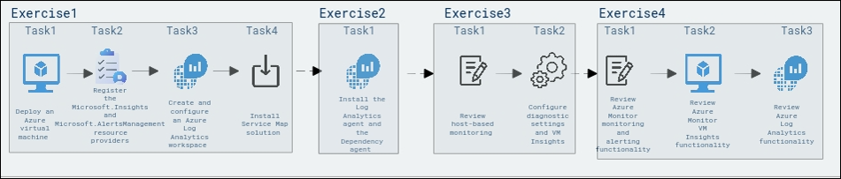

## Exercise 1: Preparing a monitoring environment

### Task 1: Deploy an Azure virtual machine

<!-- 1. Connect to **SEA-SVR2**, and if needed, sign in as **CONTOSO\\Administrator** with the password **Pa55w.rd**. -->

1. On **SEA-SVR2/LabVM**, double-click on the **Azure Portal** icon, and sign in using this credential, enter the Username: <inject key="AzureAdUserEmail"></inject> and Password: <inject key="AzureAdUserPassword"></inject>

   > **Note:** On **Action Required** page, select **Ask later**.

   >**Note:** On **Stay signed in?** page, select **Yes**.
   
   >**Note:** Select **Cancel**, on the **Welcome to Microsoft Azure** page.

1. On **SEA-SVR2/LabVM**, in the Microsoft Edge window displaying the Azure portal, open the Azure Cloud Shell pane by selecting the Cloud Shell button in the Azure portal.

   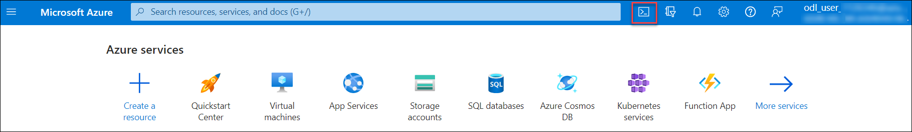

1. Selecting a ***PowerShell*** environment and creating storage if prompted. The cloud shell provides a command line interface in a pane at the bottom of the Azure portal, as shown here:

   

1. Within the Getting Started pane, select **Mount storage account**, select your **Storage account subscription** from the dropdown and click **Apply**.

   

1. Within the **Mount storage account** pane, select **I want to create a storage account** and click **Next**.

   


1. If you are prompted to create storage for your Cloud Shell, ensure your subscription is selected, Please make sure you have selected your resource group **az-801** and enter **blob<inject key="DeploymentID" enableCopy="false"/>** for the **Storage account name** and enter **fs<inject key="DeploymentID" enableCopy="false"/>** For the **File share name**, and select the region to **East US**, then click on **Create**.

1. Wait for PowerShell terminal to start.

1. In the toolbar of the Cloud Shell pane, select the **Manage files** icon, in the drop-down menu select **Upload**, and upload the file **C:\\AllFiles\\AZ-801-Configuring-Windows-Server-Hybrid-Advanced-Services-master\\Allfiles\\Labfiles\\Lab09\\L09-rg_template.json** into the Cloud Shell home directory.

1. Repeat the previous step to upload the **C:\\AllFiles\\AZ-801-Configuring-Windows-Server-Hybrid-Advanced-Services-master\\Allfiles\\Labfiles\\Lab09\\L09-rg_template.parameters.json** file into the Cloud Shell home directory.

1. To create the resource group that will be hosting the lab environment, in the **PowerShell** session in the Cloud Shell pane, enter the following commands one by one, and after entering each command, press Enter (replace the `<Azure_region>` placeholder with **<inject key="Region"></inject>**):

   ```powershell 
   $location = '<Azure_region>'
   $rgName = 'AZ801-L0901-RG'
   New-AzResourceGroup -ResourceGroupName $rgName -Location $location
   ```

1. To deploy an Azure virtual machine (VM) into the newly created resource group, enter the following command and press Enter:

   ```powershell 
   New-AzResourceGroupDeployment -Name az801l0901deployment -ResourceGroupName $rgName -TemplateFile ./L09-rg_template.json -TemplateParameterFile ./L09-rg_template.parameters.json -AsJob
   ```

### Task 2: Register the Microsoft.Insights and Microsoft.AlertsManagement resource providers

1. To register the Microsoft.Insights and Microsoft.AlertsManagement resource providers, on **SEA-SVR2**, from the Cloud Shell pane, enter the following commands one by one, and after entering each command, press Enter.

   ```powershell
   Register-AzResourceProvider -ProviderNamespace Microsoft.Insights
   Register-AzResourceProvider -ProviderNamespace Microsoft.AlertsManagement
   ```

   >**Note**: To verify the registration status, you can use the **Get-AzResourceProvider** cmdlet.

   >**Note**: Do not wait for the registration process to complete but instead proceed to the next task. The registration should take about 3 minutes.

1. Close Cloud Shell.

### Task 3: Create and configure an Azure Log Analytics workspace

1. On **SEA-SVR2**, in the Azure portal, in the **Search resources, services, and docs** text box, in the toolbar, search for and select **Log Analytics workspaces (1)**, and then, from the **Log Analytics workspaces (2)** page, select **+ Create**.

   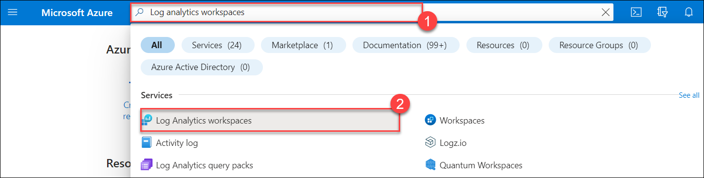

1. On the **Basics** tab of the **Create Log Analytics workspace** page, enter the following settings, select **Review + Create**, and then select **Create**:

   | Settings | Value |
   | --- | --- |
   | Subscription | the name of the Azure subscription you are using in this lab |
   | Resource group | **AZ801-L0901-RG** |
   | Name | **workspace<inject key="DeploymentID" enableCopy="false"/>** |
   | Region | **<inject key="Region"></inject>** |

   >**Note**: Make sure that you specify the same region into which you deployed virtual machines in the previous task.

   >**Note**: Wait for the deployment to complete. Then select **Go to resource**.

      

1. On the workspace blade, from the left-hand navigation pane, under **Settings**, select **Agents**, under **Log Analytics agent instructions**, record the values of the **Workspace ID** and **Primary key**. You will need them in the next exercise.

   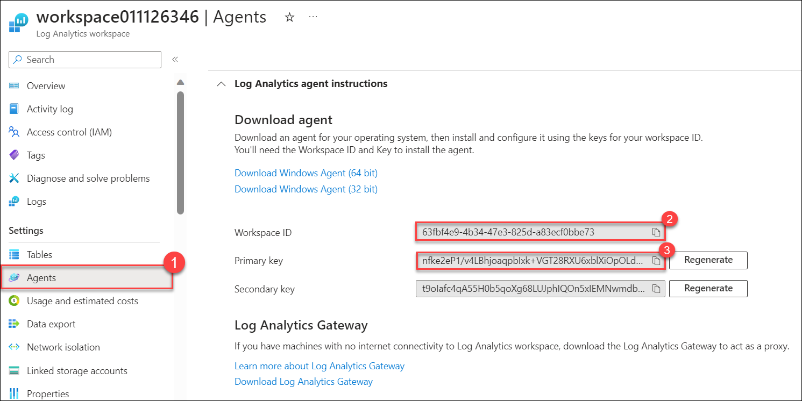

> **Congratulations** on completing the task! Now, it's time to validate it. Here are the steps:
   > - Navigate to the Lab Validation Page, from the upper right corner in the lab guide section.
   > - Hit the Validate button for the corresponding task. If you receive a success message, you can proceed to the next task. 
   > - If not, carefully read the error message and retry the step, following the instructions in the lab guide.
   > - If you need any assistance, please contact us at labs-support@spektrasystems.com. We are available 24/7 to help you out.

### Task 4: Install Service Map solution

1. On **SEA-SVR2**, in the Azure portal, in the **Search resources, services, and docs** text box, in the toolbar, search for **Service Map** and, in the list of results, in the **Marketplace** section, select **Service Map**.

   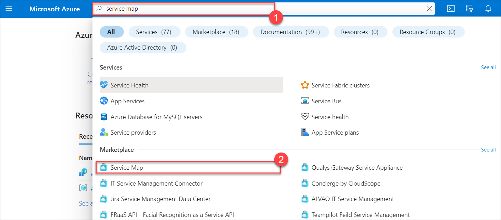

1. On the **Create Service Map Solution** blade, on the **Select Workspace** tab, specify the following settings, select **Review + Create**, and then select **Create**:

   | Settings | Value |
   | --- | --- |
   | Subscription | select the name of the Azure subscription you are using in this lab |
   | Resource group | **AZ801-L0901-RG** |
   | Log Analytics Workspace | select the name of the Log Analytics workspace you created in the previous task |

## Exercise 2: Configuring monitoring of on-premises servers

### Task 1: Install the Log Analytics agent and the Dependency agent

1. In the Azure portal, in the **Search resources, services, and docs** text box, in the toolbar, search for and select **Log Analytics workspaces**, and select your workspace that you created. 

1. From the left-hand navigation pane, under **Settings**, select **Agents**, on the **Agents** blade, under **Log Analytics agent instructions**, select the **Download Windows Agent (64 bit)** link to download the 64-bit Windows Log Analytics agent. 

   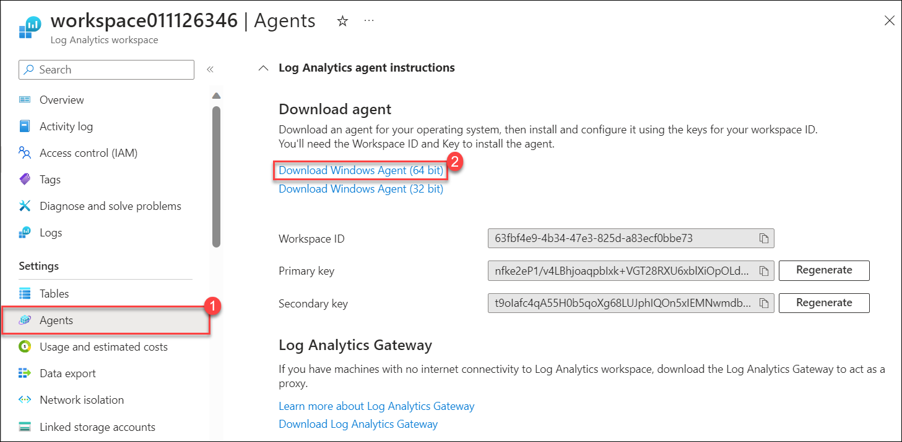

1. Once the download of the agent installer is completed, click the downloaded file to start the setup wizard. 

1. On the **Welcome** page, select **Next >**.

1. On the **License Terms** page, read the license and then select **I Agree**.

   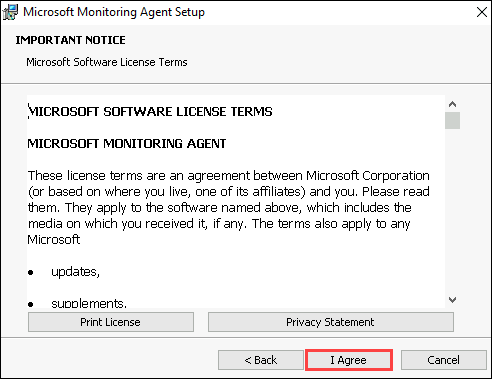

1. On the **Destination Folder** page, change or keep the default installation folder and then select **Next >**.

   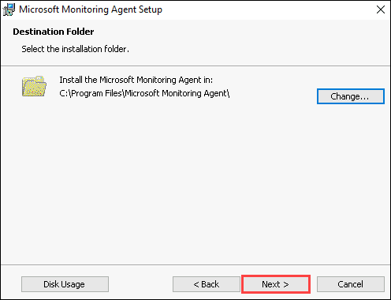

1. On the **Agent Setup Options** page, select **Connect the agent to Azure Log Analytics** checkbox and then select **Next >**.

   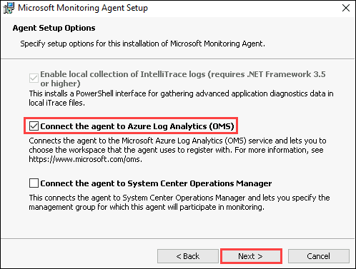

1. On the **Azure Log Analytics** page, enter 
the **Workspace ID** and **Workspace Key (Primary Key)** you recorded in the previous exercise.

   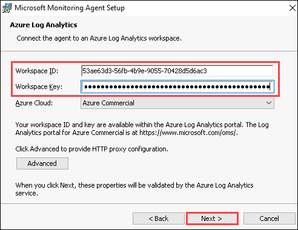

1. Select **Next >** once you have completed providing the necessary configuration settings.

1. On the **Microsoft Update** page, review your choices and then select **Next >**.

   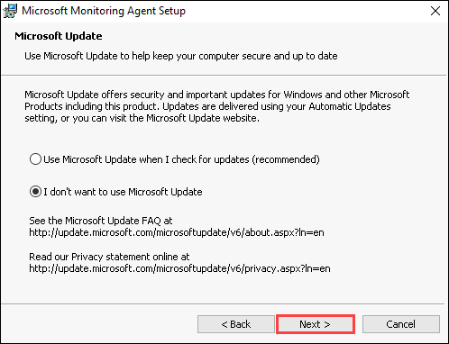

1. On the **Ready to Install** page, review your choices and then select **Install**.

   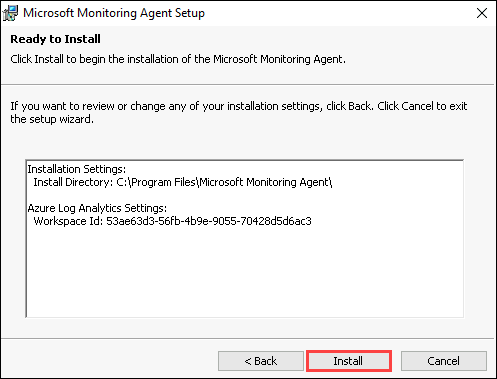

1. On the **Configuration completed successfully** page, select **Finish**.

   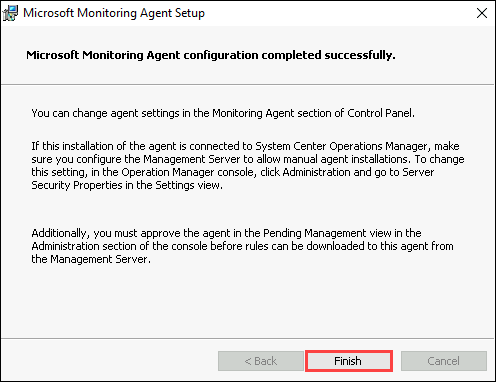

1. On **SEA-SVR2**, start Windows PowerShell as administrator.

1. From the **Administrator: Windows PowerShell** console, run the following commands to install Dependency Agent:

   ```powershell
   Invoke-WebRequest "https://aka.ms/dependencyagentwindows" -OutFile InstallDependencyAgent-Windows.exe
   .\InstallDependencyAgent-Windows.exe /S
   ```

## Exercise 3: Configuring monitoring of Azure VMs

### Task 1: Review host-based monitoring

1. In the Azure portal, search for and select **Virtual machines**, and on the **Virtual machines** page, select **az801l09-vm0**.

   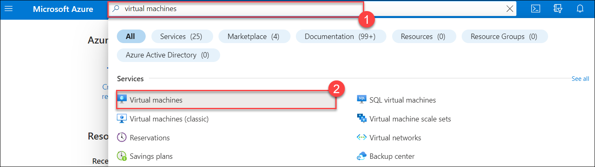

1. On the **az801l09-vm0** page, from the left-hand navigation pane, under **Monitoring** section, select **Metrics**.

1. On the **az801l09-vm0 \| Metrics** page, on the default chart, in the **Metric Namespace** drop-down list, note that only **Virtual Machine Host** metrics are available.

   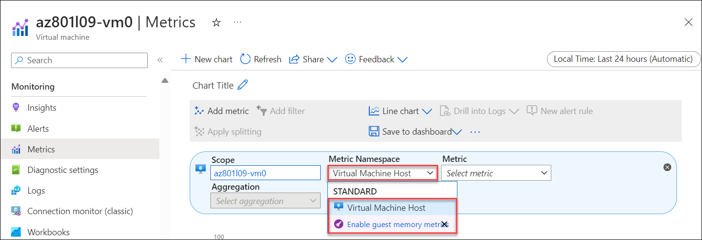

   >**Note**: This is expected because no guest-level diagnostic settings have been configured yet. However, you do have the option of enabling guest memory metrics directly from the **Metric Namespace** drop-down list. You will enable it later in this exercise.

1. In the **Metric** drop-down list, review the list of available metrics.

   >**Note**: The list includes a range of CPU, disk, and network-related metrics that can be collected from the virtual machine host without having access into guest-level metrics.

1. In the **Metric** drop-down list, select **Percentage CPU**, in the **Aggregation** drop-down list, ensure that the **Avg** entry is selected, and review the resulting chart.

### Task 2: Configure diagnostic settings and VM Insights

1. On the **az801l09-vm0** page, in the **Monitoring** section, select **Diagnostic settings**.

1. On the **Overview** tab of the **az801l09-vm0 \| Diagnostic settings** page, under **Diagnostics storage account**, select the storage account with the name like this **az10411xxxxxxxxxxxxxx**, then select **Enable guest-level monitoring**.

   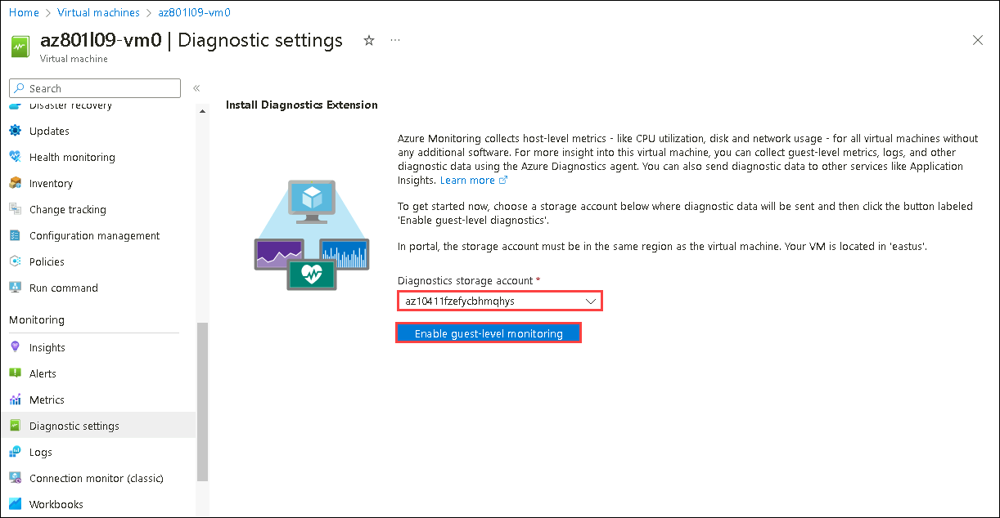

   >**Note**: Wait for the operation to take effect. This might take about few minutes.

1. Switch to the **Performance counters** tab of the **az801l09-vm0 \| Diagnostic settings** page and review the available counters.

   >**Note**: By default, CPU, memory, disk, and network counters are enabled.
   
1. On the **az801l09-vm0 \| Diagnostic settings** page, select the **Event Tracing** tab, on the **Event Tracing** tab, review the available event log collection options.

   >**Note**: By default, log collection includes critical, error, and warning entries from the Application Log and System log, as well as Audit failure entries from the Security log. You can customize them from the **Logs** tab.

1. On the **az801l09-vm0 \| Diagnostic settings** page, select the **Logs** tab and review the available configuration settings.

1. On the **az801l09-vm0 \| Diagnostic settings** page, from the left-hand navigation, under **Monitoring** section, select **Metrics**.

1. On the **az801l09-vm0 \| Metrics** page, on the default chart, note that at this point, the **Metric Namespace** drop-down list, in addition to the **Virtual Machine Host** entry, also includes the **Guest (classic)** entry.

   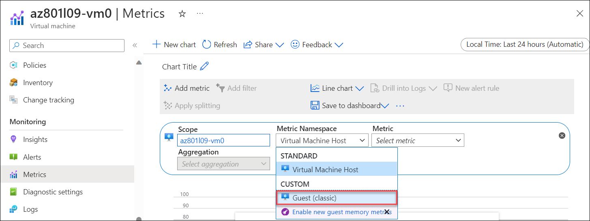

   >**Note**: This is expected because you enabled guest-level diagnostic settings. You also have the **Enable new guest memory metrics** option.

1. In the **Metric Namespace** drop-down list, select the **Guest (classic)** entry.

1. In the **Metric** drop-down list, review the list of available metrics and note that they include a range of metrics related to memory and logical disks.

   >**Note**: The list includes additional guest-level metrics not available when relying on the host-level monitoring only.

1. In the **Metric Namespace** drop-down list, select the **Enable new guest memory metrics** entry.

1. In the **Enable Guest Metrics (Preview)** pane, review the provided information, after reviewing close it.

1. On the **az801l09-vm0 \| Metrics** page, select the **Diagnostic settings** from the left-hand navigation pane under **Monitoring** section, select the **Sinks** tab, in the **Azure Monitor (Preview)** section, select **Enable Azure Monitor**, and then select **Apply**. 

    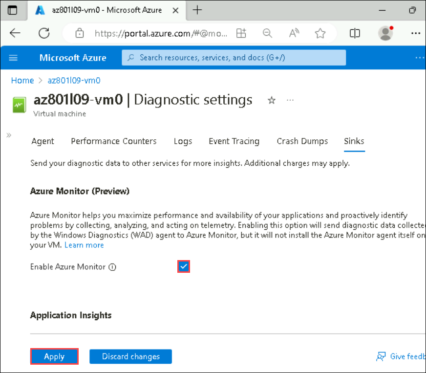

   >**Note**: If the **Enable Azure Monitor** option is disabled, then select the warning notification box below (The Azure Monitor sink requires a managed identity. Click to configure a managed identity in Azure AD for this VM.) the Azure Monitor (Preview) section to activate the Enabled button. Select the **On** toggle button under **Status**, and click on **Save**. On the pop-up select **Yes**. Go back to this page, **az801l09-vm0 | Diagnostic settings**. Refresh the page, and re-do the step-12 again.

1. From the left-hand navigation, under **Monitoring** section, select **Metrics**. On the default chart, note that at this point, the **Metric Namespace** drop-down list, in addition to the **Virtual Machine Host** and **Guest (classic)** entries, also includes the **Virtual Machine Guest** entry.

   >**Note**: You might need to refresh the page for the **Virtual Machine Guest** entry to appear.

   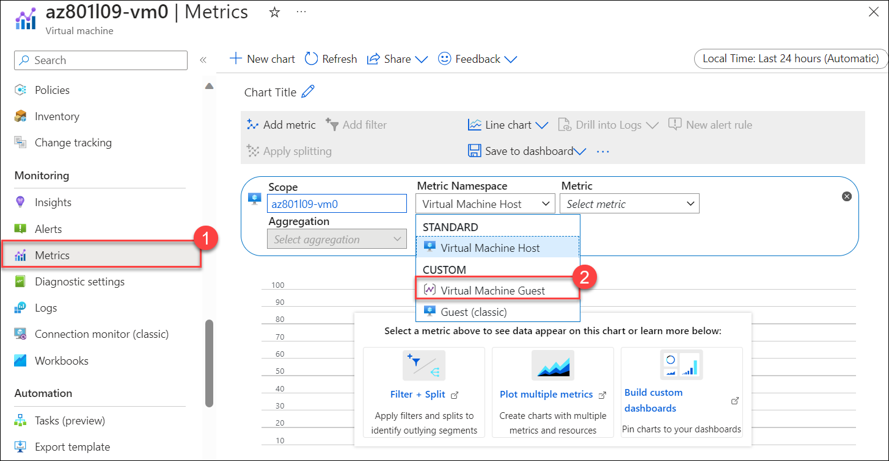

1. On the **az801l09-vm0 \| Metrics** page, from the left-hand navigation side pane, under the **Monitoring** section, select **Logs**.

1. If needed, on the **az801l09-vm0 \| Logs** page, select **Enable**.

   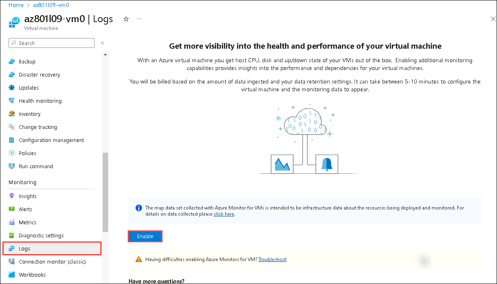

1. In the **Monitoring configuration** page, select **Configure**.

   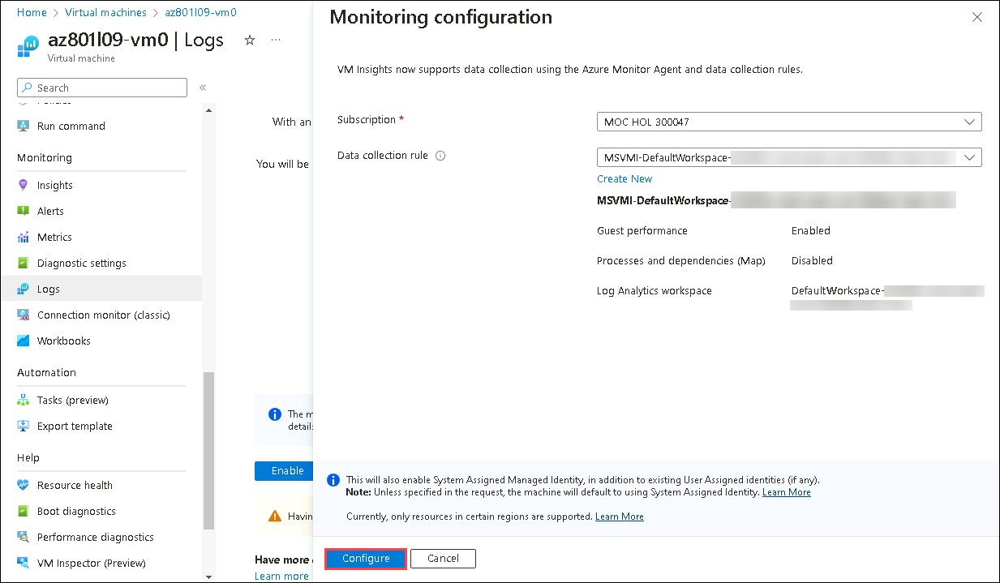

   >**Note**: Wait for the deployment to get succeed. After the deployment get succeeded, **Refresh** the page. 

<!-- 1. If needed, on the **az801l09-vm0 \| Insights** page, select **Enable**.

>**Note**: This setting provides the Azure VM Insights functionality. VM Insights is an Azure Monitor solution that facilitates monitoring performance and health of both Azure VMs and on-premises computers running Windows or Linux.-->


17. On **SEA-SVR2**, in the Azure portal, in the **Search resources, services, and docs** text box, in the toolbar, search for and select **Monitor**, and then, on the **Monitor \| Overview** page, from the left-hand navigation pane, under **Insights** section, select **Virtual Machines**.

18. On the **Monitor \| Virtual Machines** page, select the **Performance** tab and Scroll down to review the performance metrics for the virtual machine.

    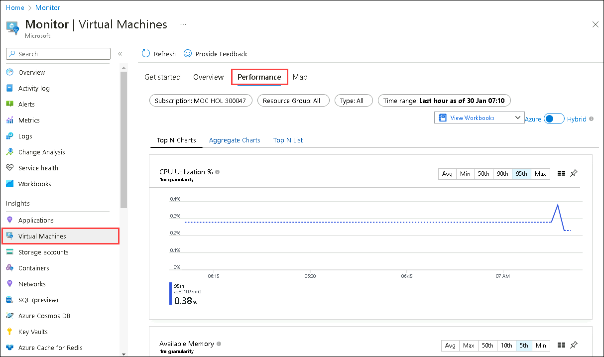

   >**Note**: This option enables monitoring and alerting capabilities using health model, which consists of a hierarchy of health monitors built using the metrics emitted by Azure Monitor for VMs.

## Exercise 4: Evaluating monitoring services

### Task 1: Review Azure Monitor monitoring and alerting functionality

1. On the **Monitor** page, from the left-hand navigation pane, select **Metrics**.

1. On the **Select a scope** page, on the **Browse** tab, browse to the **AZ801-L0901-RG** resource group, expand it, select the checkbox next to the **az801l09-vm0** virtual machine entry within that resource group, and then select **Apply**.

   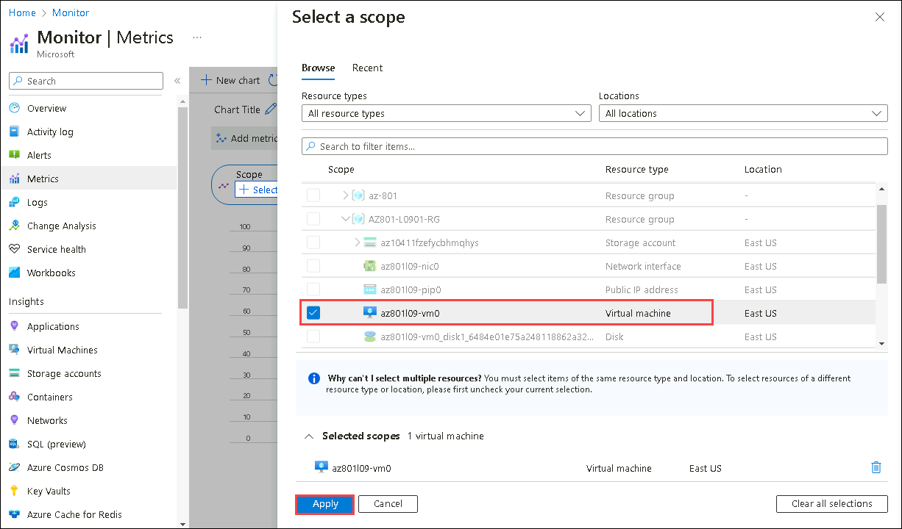

   >**Note**: If you do not see **az801l09-vm0** in the list, in the **Search to filter items...** box, search for **az801l09-vm0**.
   
   >**Note**: This gives you the same view and options as those available from the **az801l09-vm0 \| Metrics** page.

1. In the **Metric** drop-down list, select **Percentage CPU**, ensure that **Avg** appears in the **Aggregation** drop-down list, and review the resulting chart.

   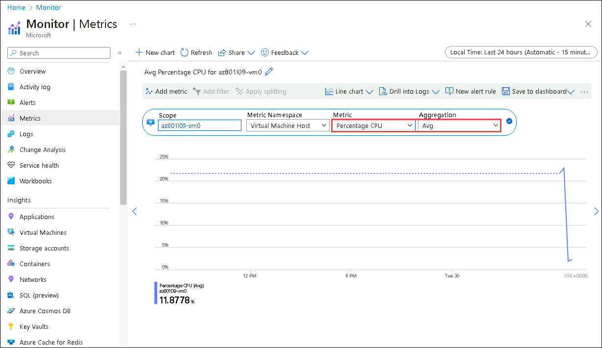

1. On the **Monitor \| Metrics** page, in the **Avg Percentage CPU for az801l09-vm0** pane, select **New alert rule**.

    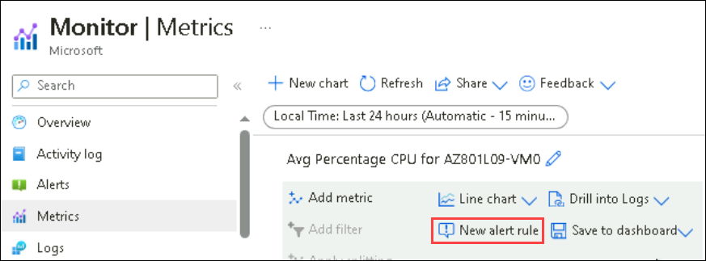

   >**Note**: Creating an alert rule from Metrics is not supported for metrics from the Guest (classic) metric namespace. This can be accomplished by using Azure Resource Manager templates, as described in the document **[Send Guest OS metrics to the Azure Monitor metric store using a Resource Manager template for a Windows virtual machine](https://docs.microsoft.com/en-us/azure/azure-monitor/platform/collect-custom-metrics-guestos-resource-manager-vm)**.

1. On the **Create an alert rule** page, in the **Condition** section, in the **Alert logic** section, specify the following settings (leave others with their default values), and then select **Next: Actions >**:

   | Settings | Value |
   | --- | --- |
   | Threshold | **Static** |
   | Operator | **Greater than** |
   | Aggregation type | **Average** |
   | Threshold value | **2** |
   | Check every | **1 minute** |
   | Lookback period | **1 Minute** |

   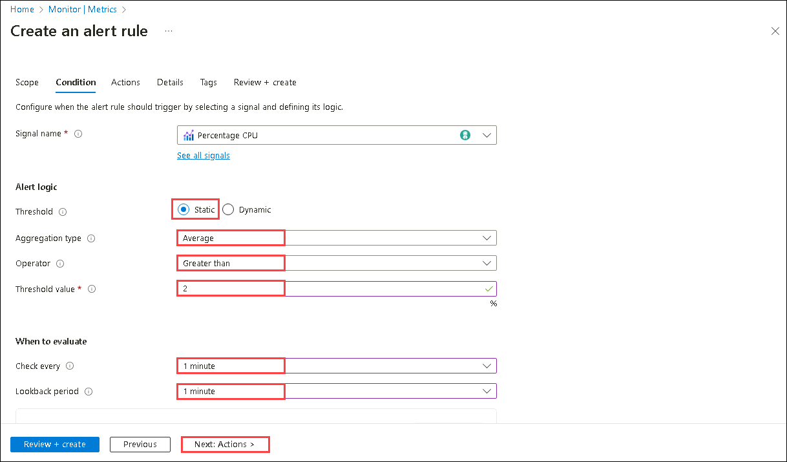

1. On the **Create an alert rule** page, on the **Actions** tab, if prompted close the **Use quick actions (preview)** tab and select **Use action group** in **Select actions**. 

1. Click on **Create action group**. On the **Basics** tab of the **Create an action group** page, specify the following settings (leave others with their default values), and then select **Next: Notifications >**:

   | Settings | Value |
   | --- | --- |
   | Subscription | the name of the Azure subscription you are using in this lab |
   | Resource group | **AZ801-L0901-RG** |
   | Action group name | **az801l09-ag1** |
   | Display name | **az801l09-ag1** |

   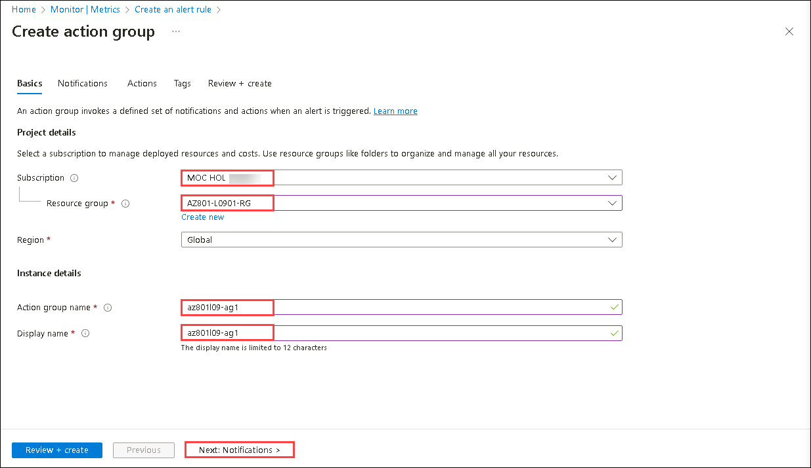

1. On the **Notifications** tab of the **Create an action group** page, in the **Notification type** drop-down list, select **Email/SMS message/Push/Voice**. A new tab **Email/SMS message/Push/Voice** will open, select the **Email** checkbox, type your email address in the **Email** textbox, leave others with their default values, and then select **OK**.

   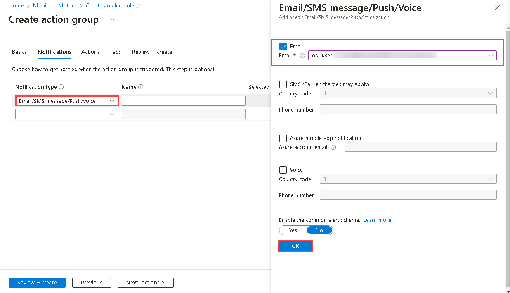

1. Back on the **Notifications** tab of the **Create an action group** page, In the **Name** text box, type **admin email**. Select **Next: Actions  >**.

   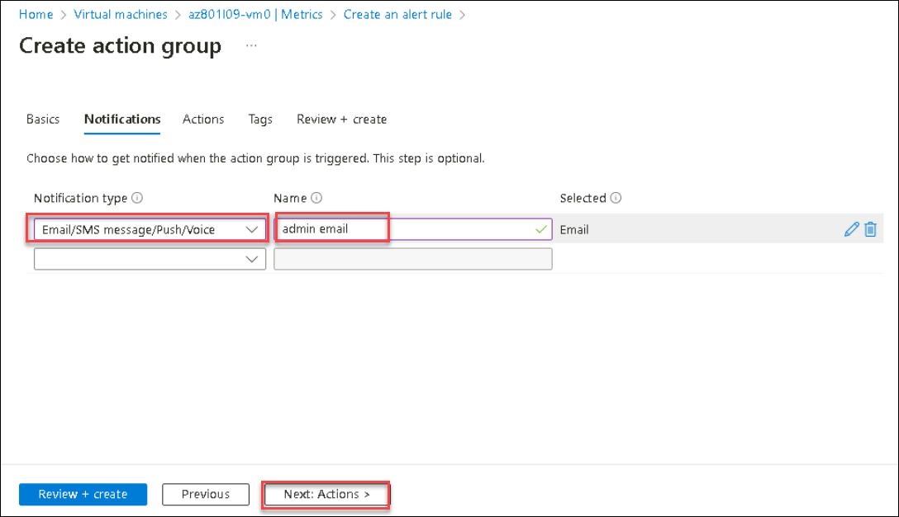

1. On the **Actions** tab of the **Create an action group** page, review items available in the **Action type** drop-down list without making any changes and select **Review + create**.

   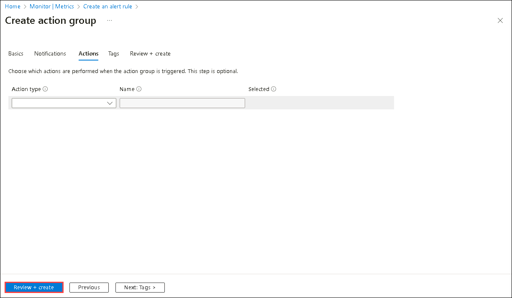

1. On the **Review + create** tab of the **Create an action group** page, select **Create**.

   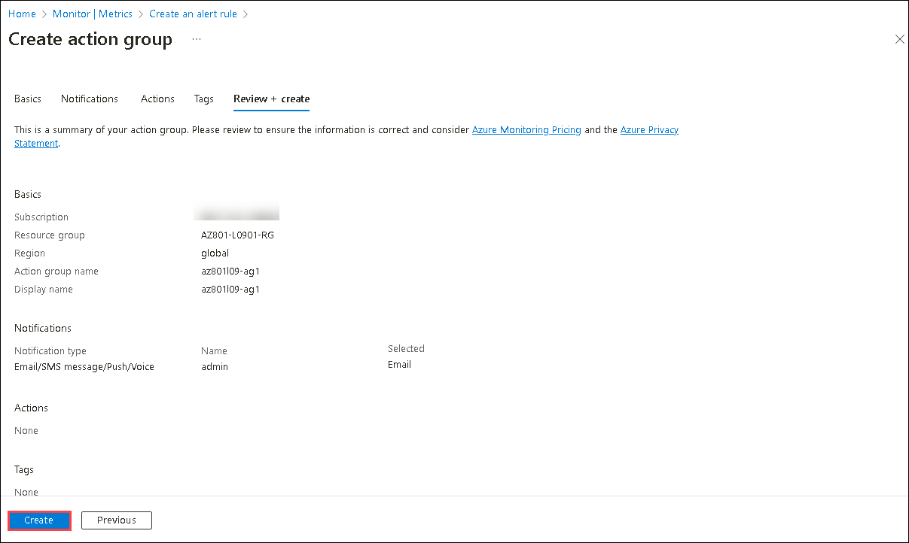

1. Back on the **Create an alert rule** page, select **Next: Details  >**, in the **Project details** section, specify the following settings (leave others with their default values):

   | Settings | Value |
   | --- | --- |
   | Alert rule name | **CPU Percentage above the test threshold** |
   | Alert rule description | **CPU Percentage above the test threshold** |
   | Resource group | **AZ801-L0901-RG** |
   | Severity | **3- Informational** |
   |select **Advanced options**|
   | Enable upon creation | select the checkbox if it is not selected.|

   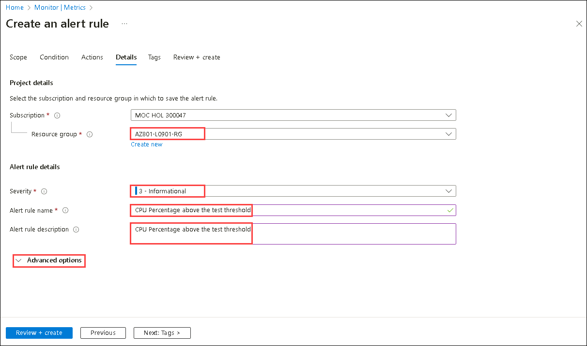

   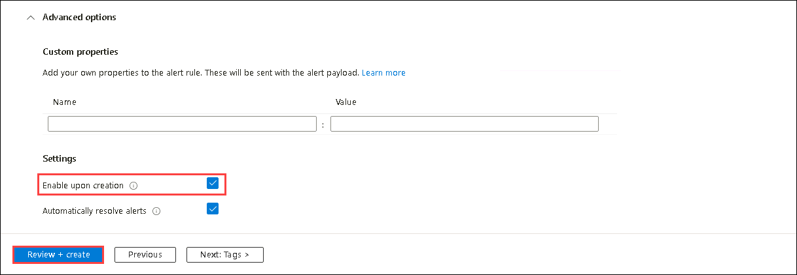

1. On the **Details** tab of the **Create an alert rule** page, select **Review + create**, select **Create**.

   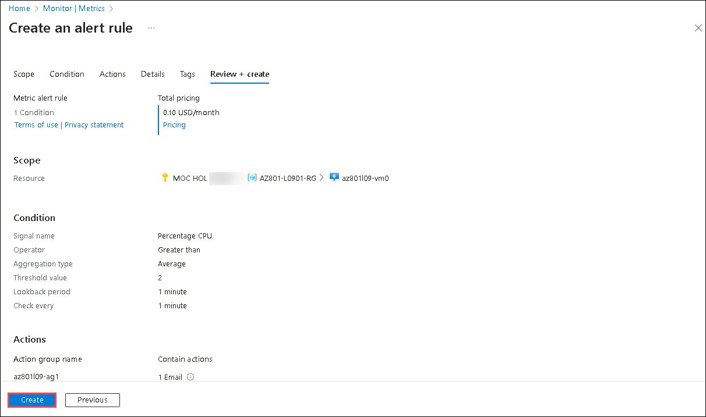

   >**Note**: It can take up to 10 minutes for a metric alert rule to become active.

1. In the Azure portal, search for and select **Virtual machines**, and on the **Virtual machines** page, select **az801l09-vm0**.

1. On the **az801l09-vm0** page, from the left-hand navigation pane, under **Operations** section, select **Run command**, and then select **RunPowerShellScript**.

1. On the **Run Command Script** page, in the **PowerShell Script** section, enter the following commands and select **Run** to increase the CPU utilization within the target operating system:

   ```powershell
   $vCpuCount = Get-WmiObject Win32_Processor | Select-Object -ExpandProperty NumberOfLogicalProcessors
   ForEach ($vCpu in 1..$vCpuCount){ 
      Start-Job -ScriptBlock{
         $result = 1;
         ForEach ($loopCount in 1..2147483647){
            $result = $result * $loopCount
         }
      }
   }
   ```
   <!-- >**Note**: When you press **"T"** to enter the PowerShell commands, the code automatically inserts three additional curly braces. This will cause the script to fail so make sure you remove the three additional braces before you select **Run**. -->

   >**Note**: This should increase the CPU utilization above the threshold of the newly created alert rule.

1. On **SEA-SVR2**, in the Microsoft Edge window displaying the Azure portal, open another tab, search and select for **Monitor**, and then select **Alerts** from the left-hand navigation pane.

1. Note the number of **Sev 3** alerts, and then select the **Sev 3** row.

   >**Note**: You might need to wait for a few minutes and try to **Refresh** the page.

1. On the **All Alerts** page, review generated alerts.

   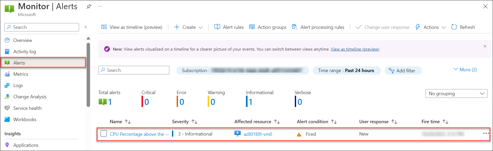

>**Note**: Alerts may take a while to appear on the portal, but if you set up email notifications when creating the alert rule, you will receive instant email notifications.

1. Alternatively, you can choose the **View as timeline (preview)** option to review the alerts that have been generated.

   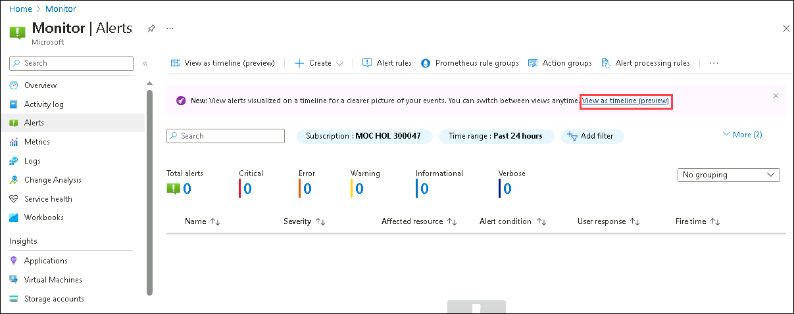

1. Navigate to the subscription group, expand it, open the **AZ801-L0901-RG** resource group, choose the entry for the **az801l09-vm0** virtual machine within that resource group, select the count of generated alerts. i.e. **4** in this case and you will find the generated alerts.

   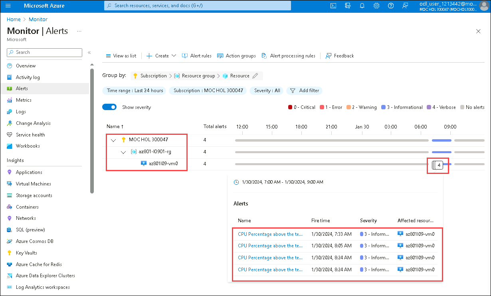

> **Congratulations** on completing the task! Now, it's time to validate it. Here are the steps:
   > - Navigate to the Lab Validation Page, from the upper right corner in the lab guide section.
   > - Hit the Validate button for the corresponding task. If you receive a success message, you can proceed to the next task. 
   > - If not, carefully read the error message and retry the step, following the instructions in the lab guide.
   > - If you need any assistance, please contact us at labs-support@spektrasystems.com. We are available 24/7 to help you out.

### Task 2: Review Azure Monitor VM Insights functionality

1. On **SEA-SVR2**, in the Azure portal, browse back to the **az801l09-vm0** virtual machine page.

1. On the **az801l09-vm0** virtual machine page, from the left-hand side navigatione pane, under **Monitoring** section, select **Insights**.

1. On the **az801l09-vm0 \| Insights** page, on the **Performance** tab, review the default set of metrics, including logical disk performance, CPU utilization, available memory, as well as bytes sent and received rates.

   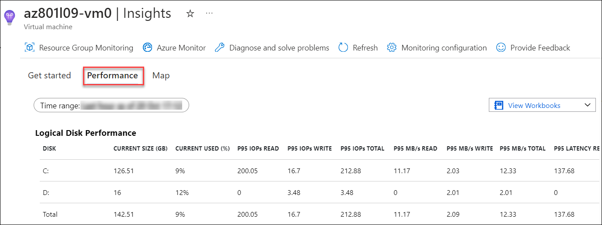

<!-- 1. On the **az801l09-vm0 \| Insights** page, select the **Map** tab and review the autogenerated map. -->

<!-- 1. On the **az801l09-vm0 \| Insights** page, select the **Health** tab and review its content.

   >**Note**: The availability of health information is dependent on completion of the workspace upgrade. (health tab is not there)-->

### Task 3: Review Azure Log Analytics functionality

1. On **SEA-SVR2**, in the Azure portal, browse back to the **Monitor** page and select **Logs**.

   >**Note**: You might need to close the **Welcome to Log Analytics** and **Queries** pane if this is the first time you access Log Analytics.

1. Choose **Select scope**, on the **Browse** tab, browse to the **AZ801-L0901-RG** resource group, expand it, select the checkbox next to the **workspace<inject key="DeploymentID" enableCopy="false"/>** you created earlier in this lab, and then select **Apply**.

1. In the query window, paste the following query, select **Run**:

   ```kql
   // Virtual Machine available memory
   // Chart the VM's available memory over the last hour.
   InsightsMetrics
   | where TimeGenerated > ago(1h)
   | where Name == "AvailableMB"
   | project TimeGenerated, Name, Val
   | render timechart
   ```

1. Select **Queries** in the toolbar, in the **Queries** pane, expand the **Virtual Machines** node, hover on  **Track VM availability using Heartbeat** tile, and select the **Run** button.

   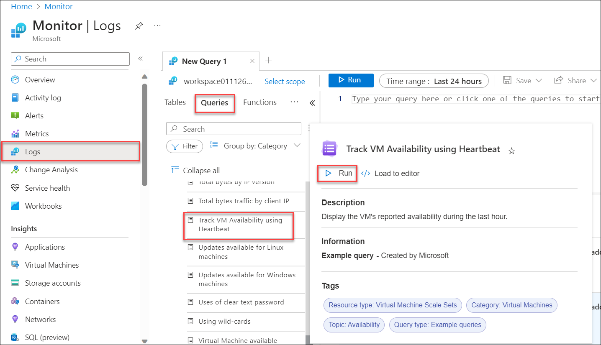

1. On the **New Query 1** tab, select the **Tables (1)** header, and expand the **Azure Resources** section, to review the list of tables.

   >**Note**: The names of several tables correspond to the solutions you installed earlier in this lab. In particular, **InsightMetrics** is used by Azure VM Insights to store performance metrics.

1. Move the cursor over the **VMComputer (2)** entry, select the **See Preview data (3)** icon, and review the results.

   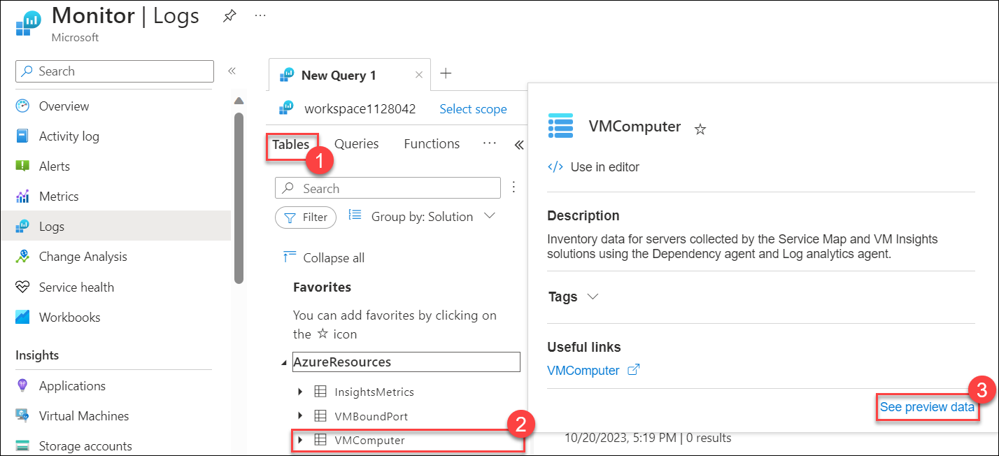

   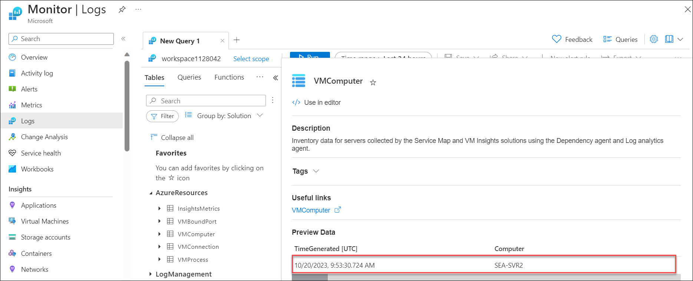

   >**Note**: Verify that the data includes entry **SEA-SVR2**.

1. On **SEA-SVR2**, in the Azure portal, in the **Search resources, services, and docs** text box, in the toolbar, search for and select **Log Analytics workspaces**, and then, from the **Log Analytics workspaces** page, select the **workspace<inject key="DeploymentID" enableCopy="false"/>** you created earlier in this lab.

1. On the workspace page, from the left-hand navigation menu, under **Classic** section, select **Legacy solutions**.

1. In the list of solutions, select **ServiceMap**, and then, on the **Summary** page, select the **Service Map** tile.

    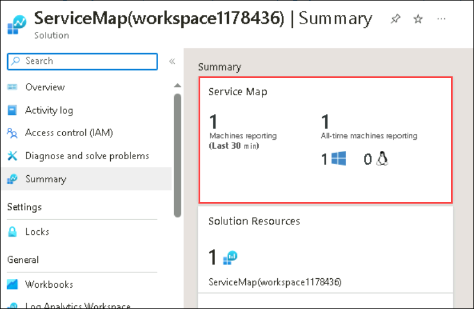

1. On the **ServiceMap** page, on the **Machines** tab, select **SEA-SVR2** to display is service map.

    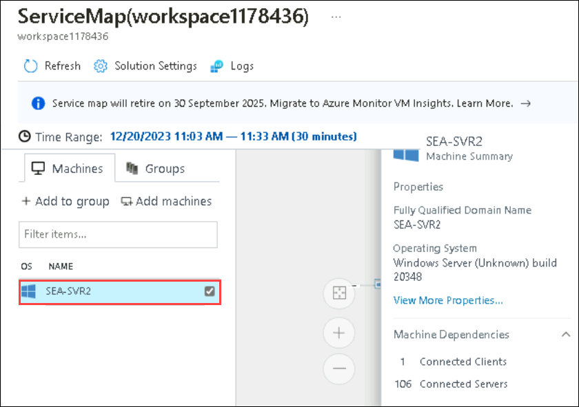

1. Zoom in to review the map illustrating the network ports available on **SEA-SVR2**, select different ports and review the corresponding connection information.

1. For each connection, switch between the **Summary** and **Properties** views, with the latter providing more detailed information regarding connection targets.

   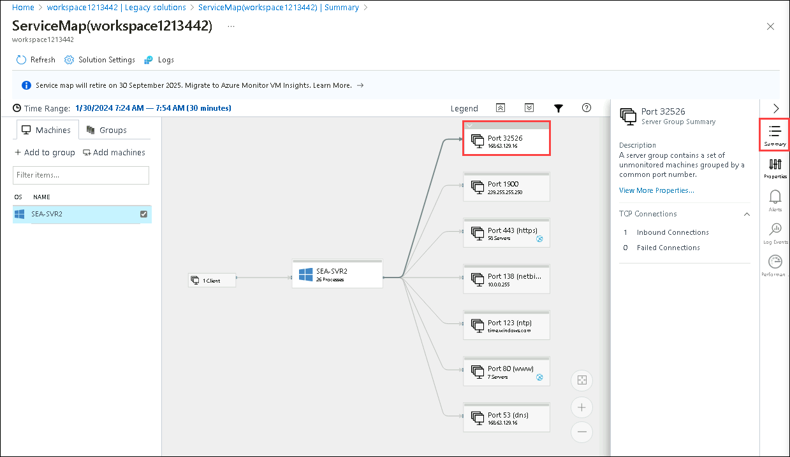

   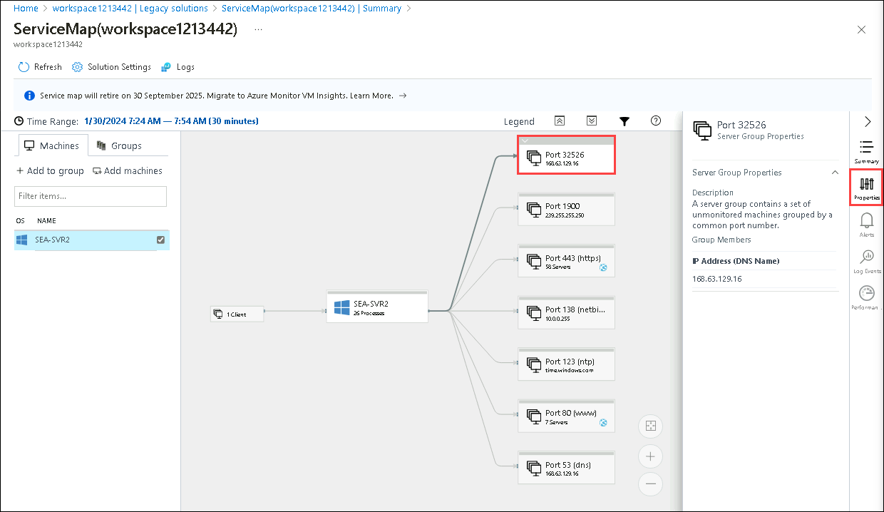

<!-- ## Exercise 5: Deprovisioning the Azure environment

#### Task 1: Start a PowerShell session in Cloud Shell

1. On **SEA-SVR2**, in the Microsoft Edge window displaying the Azure portal, open the Cloud Shell pane by selecting the **Cloud Shell** icon.

#### Task 2: Delete all Azure resources provisioned in the lab

1. From the Cloud Shell pane, run the following command to list all resource groups created in this lab:

   ```powershell
   Get-AzResourceGroup -Name 'AZ801-L09*'
   ```

   > **Note**: Verify that the output contains only the resource group you created in this lab. This group will be deleted in this task.

1. Run the following command to delete all resource groups you created in this lab:

   ```powershell
   Get-AzResourceGroup -Name 'AZ801-L09*' | Remove-AzResourceGroup -Force -AsJob
   ```

   >**Note**: The command executes asynchronously (as determined by the *-AsJob* parameter). So, while you'll be able to run another PowerShell command immediately afterwards within the same PowerShell session, it will take a few minutes before the resource groups are actually removed. -->

### Review
In this lab, you have completed:
- Prepared a monitoring environment.
- Configured monitoring of on-premises servers.
- Configured monitoring of Azure VMs.
- Evaluated monitoring services.


### You have successfully completed the lab
